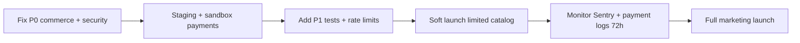

# Niloora — Production Readiness Report

**Generated:** 2026-06-06  
**Role:** Principal Software Engineer  
**Inputs:** [project-audit.md](./project-audit.md) · [runtime-audit.md](./runtime-audit.md) · [security-audit.md](./security-audit.md) · [database-audit.md](./database-audit.md) · [tests/README.md](../tests/README.md)  
**Verdict:** **Not production-ready** — resolve all **P0** items before accepting paid traffic for unique inventory.

---

## Executive Summary

Niloora is a well-structured Next.js 14 jewelry e-commerce platform with server-authoritative pricing, Prisma/PostgreSQL, layered API handlers, Sentry observability, and a Persian-first RTL storefront. Architecture and domain modeling are **above average** for a boutique gallery product.

However, cross-audit synthesis reveals **blocking gaps** in commerce integrity (inventory, payments, gift cards), access control (moderation leak, open redirect), and operational hardening (distributed rate limits, callback error paths). Automated testing covers core pricing/cart logic but **does not yet guard** the highest-risk payment and inventory paths end-to-end.

| Metric | Value |
|--------|-------|
| **Overall readiness score** | **64 / 100** |
| **Recommendation** | Fix **12 P0** issues → re-audit → staged launch with monitoring |
| **Audit findings ingested** | 140+ (56 runtime · 43 security · 41 database) |
| **Automated tests** | 136 (80 Vitest + 56 Jest) · 9 Playwright E2E specs |
| **API routes** | ~112 |
| **Prisma models** | 37 |

---

## Category Scores (0–100)

| Category | Score | Rationale |
|----------|------:|-----------|
| **Security** | **58** | Strong session model on APIs and Prisma safety; undermined by moderation leak, open redirect, weak reset token, missing login rate limits, stale JWT admin at edge, and public analytics writes. |
| **Performance** | **65** | Sentry + `sharp` image pipeline; hurt by ~2,000+ lines dead code (customizer wizard chain), heavy Three.js customize path, full-catalog loads, and no distributed caching layer. |
| **Maintainability** | **71** | Clear `src/lib/server` separation, consistent `handleRouteError`, good audit docs; offset by duplicate dashboard/customizer code, dual test runners (Vitest + Jest), and 140+ open findings. |
| **Scalability** | **54** | Single PostgreSQL fits current scale; in-memory rate limits fail on serverless multi-instance, JSON cart/wishlist blobs, no stock reservation, and shared cron secret limit horizontal ops maturity. |
| **Testing** | **60** | 136 unit/integration tests passing; new Playwright suite is smoke-level; no live-DB integration, no payment-callback tests, no inventory regression tests, no CI coverage gates. |
| **UX** | **68** | Polished Persian UI, empty states, server pricing transparency; payment-return races, login cart overwrite, hydration flashes, and post-payment 500s damage trust at checkout. |
| **SEO** | **76** | `sitemap.ts`, robots, structured data (`src/lib/seo/`), faceted `/shop/[facet]/[slug]` URLs; `[locale]` routes empty, many product pages client-heavy, i18n incomplete. |

### Score visualization

```
Security        ████████████░░░░░░░░░░  58
Performance     █████████████░░░░░░░░░  65
Maintainability ██████████████░░░░░░░░  71
Scalability     ███████████░░░░░░░░░░░  54
Testing         ████████████░░░░░░░░░░  60
UX              █████████████░░░░░░░░░  68
SEO             ███████████████░░░░░░░  76
────────────────────────────────────────
Overall         █████████████░░░░░░░░░  64
```

---

## Audit Cross-Reference

| Source | Critical | High | Medium | Low | Total |
|--------|----------|------|--------|-----|-------|
| Runtime | 2 | 12 | 24 | 18 | 56 |
| Security | 2 | 11 | 18 | 12 | 43 |
| Database | 4 | 11 | 16 | 10 | 41 |
| Architecture | — | — | — | — | Structural baseline documented |
| Testing | — | — | — | — | 136 automated + 9 E2E specs |

**Top cross-cutting themes:**

1. **Payment success path** — callback error handling (runtime), gift-card orphans (runtime + DB), inventory omission (DB).
2. **Access control** — pending moderation leak (security + runtime), open redirect (security), stale JWT admin (security).
3. **Commerce integrity** — stock never decremented, BNPL side effects missing, gift-card over-commitment (DB).
4. **Client/server state** — preference sync races, auth hydration duplication (runtime).

---

## Test Coverage Assessment

| Layer | Count | Strengths | Gaps |
|-------|------:|-----------|------|
| Vitest (`src/`) | 80 | Pricing, promo, cart sanitize, order create, auth JWT edge | No payment callback, no Prisma integration |
| Jest unit (`tests/unit/`) | 38 | Search, filters, purchasability, shipping, timeline | No `repriceOrderItems` integration |
| Jest integration (`tests/integration/`) | 16 | API routes with mocked Prisma/auth | Mocks hide real DB constraint failures |
| RTL (`tests/components/`) | 2 | Badge, timeline | No cart/checkout/admin UI |
| Playwright (`tests/e2e/`) | 9 specs | Smoke: auth redirect, shop, cart API, admin guard | No logged-in checkout; browsers not in CI |

**Critical untested paths:**

- `src/app/api/payments/zarinpal/callback/route.ts` — paid redirect + side effects
- Inventory decrement (not implemented — no test possible yet)
- BNPL branch in `src/app/api/payments/zarinpal/request/route.ts`
- `consumeGiftCardForOrder` failure handling
- Full checkout E2E with Zarinpal sandbox

---

## Production Readiness Verdict

| Gate | Status |
|------|--------|
| Can deploy to staging? | **Yes** — with monitoring and no marketing spend |
| Can accept real payments for unique pieces? | **No** — inventory + oversell risk |
| Can expose site to public crawlers/users? | **No** — moderation leak + open redirect |
| Can scale traffic on serverless? | **Partial** — rate limits and DB contention unproven |

---

# Prioritized Issue Register

Each issue includes: **Description**, **Impact**, **Risk**, **Suggested Fix**, **File Location**.

---

## P0 — Must Fix Before Launch

### PR-P0-01 — Inventory never updated after successful payment

| Field | Detail |
|-------|--------|
| **Description** | `Product.stock` and `Product.availability` are validated at checkout but never decremented or set to `sold` when payment succeeds. |
| **Impact** | Unique jewelry pieces can be sold multiple times; catalog shows items as purchasable after sale. |
| **Risk** | **Critical** — financial loss, customer disputes, brand damage. |
| **Suggested Fix** | Inside payment success `$transaction`, atomically decrement stock per `OrderItem` and set `availability: "sold"` when `stock <= 0`. Re-validate stock before commit. |
| **File Location** | `src/app/api/payments/zarinpal/callback/route.ts`, `src/lib/server/orders/create-order.ts` |

**Refs:** DB-C01

---

### PR-P0-02 — Stock overselling race (check-then-act gap)

| Field | Detail |
|-------|--------|
| **Description** | Stock is read at payment request time without row lock or reservation; concurrent buyers can both pass validation and pay before either callback runs. |
| **Impact** | Two paid orders for a single-quantity item. |
| **Risk** | **Critical** — operational fulfillment failure. |
| **Suggested Fix** | Add soft reservation at order create (TTL) or `SELECT FOR UPDATE` + re-validate at callback; fail payment success if stock insufficient. |
| **File Location** | `src/lib/server/products/validate-cart-purchase.ts`, `src/app/api/payments/zarinpal/callback/route.ts`, `src/app/api/payments/zarinpal/request/route.ts` |

**Refs:** DB-C04

---

### PR-P0-03 — Public API exposes pending moderation content

| Field | Detail |
|-------|--------|
| **Description** | `GET /api/comments` and `GET /api/product-questions` accept `?status=pending` without authentication, exposing unmoderated user content. |
| **Impact** | Pre-approval reviews, Q&A, names, and media URLs readable by anyone; moderation workflow bypassed. |
| **Risk** | **Critical** — privacy violation, abuse content publication, regulatory exposure. |
| **Suggested Fix** | Force `status: "approved"` for unauthenticated callers; require `ensureAdmin` for any other status. |
| **File Location** | `src/app/api/comments/route.ts`, `src/app/api/product-questions/route.ts` |

**Refs:** SEC-CRIT-01/02, RT-C-02

---

### PR-P0-04 — Payment callback can return 500 after successful charge

| Field | Detail |
|-------|--------|
| **Description** | Zarinpal callback performs DB/session work outside the main `try/catch` (lookup, idempotent paid path, `fail()` transactions). Unhandled errors surface as raw 500. |
| **Impact** | Customer charged but sees error page; order may be `paid` while UI shows failure. |
| **Risk** | **Critical** — support load, chargebacks, trust collapse at checkout. |
| **Suggested Fix** | Wrap entire handler in try/catch; always redirect with success/fail URL; log errors to Sentry without aborting user redirect when payment is already `paid`. |
| **File Location** | `src/app/api/payments/zarinpal/callback/route.ts` |

**Refs:** RT-C-01, SEC-HIGH-07

---

### PR-P0-05 — BNPL path skips payment and fulfillment side effects

| Field | Detail |
|-------|--------|
| **Description** | When `paymentMethod === "bnpl"`, order moves to `processing` without creating `Payment`, consuming gift cards, awarding loyalty/referral, or updating inventory. |
| **Impact** | Orders appear fulfilled without settlement tracking; discounts and rewards not applied. |
| **Risk** | **Critical** — revenue leakage and incorrect CRM if BNPL is enabled in production. |
| **Suggested Fix** | Extract shared `finalizePaidOrder(tx, orderId)` used by Zarinpal callback and BNPL; create settlement record; run all side effects in one transaction. |
| **File Location** | `src/app/api/payments/zarinpal/request/route.ts`, `src/app/api/payments/zarinpal/callback/route.ts` |

**Refs:** DB-C02

---

### PR-P0-06 — Gift-card balance over-commitment across concurrent orders

| Field | Detail |
|-------|--------|
| **Description** | Gift card balance is validated at order creation but not reserved; multiple pending orders can claim the same remaining balance. |
| **Impact** | Customers receive discounts without full card debit; reconciliation errors. |
| **Risk** | **Critical** — direct revenue loss. |
| **Suggested Fix** | Reserve balance at order create (hold row) or pessimistic lock; release on payment failure/expiry. |
| **File Location** | `src/lib/server/gift-card/gift-card-service.ts`, `src/lib/server/orders/create-order.ts` |

**Refs:** DB-C03

---

### PR-P0-07 — Gift-card consumption failure silently ignored at callback

| Field | Detail |
|-------|--------|
| **Description** | `consumeGiftCardForOrder` return value is not checked; order still transitions to `processing` when consumption returns `null`. |
| **Impact** | Order records gift-card discount but card balance unchanged. |
| **Risk** | **High → P0** when gift cards are marketed — compounds PR-P0-06. |
| **Suggested Fix** | Fail transaction or flag order for manual review when `appliedAmount` cannot be debited; never mark paid without successful redeem row. |
| **File Location** | `src/app/api/payments/zarinpal/callback/route.ts`, `src/lib/server/gift-card/gift-card-service.ts` |

**Refs:** DB-H04

---

### PR-P0-08 — Open redirect on post-login `redirect` parameter

| Field | Detail |
|-------|--------|
| **Description** | Auth pages pass `redirect` query directly to `router.replace()` without path allowlist validation (`//evil.com`, external URLs accepted). |
| **Impact** | Phishing attacks using trusted domain for redirect after login. |
| **Risk** | **High → P0** for public launch — OWASP A01. |
| **Suggested Fix** | Implement `safeRedirectPath()`: allow only relative paths starting with `/`; reject `//`, `http:`, `https:`, encoded variants. |
| **File Location** | `src/app/(auth)/auth/page.tsx`, `src/lib/hooks/useAuthPage.ts`, `src/app/(auth)/forgot-password/page.tsx` |

**Refs:** SEC-HIGH-01

---

### PR-P0-09 — Weak password-reset token with no reset rate limit

| Field | Detail |
|-------|--------|
| **Description** | Reset tokens use ~32-bit entropy (8 hex chars); reset endpoint has no brute-force rate limiting. |
| **Impact** | Account takeover via token guessing within 30-minute TTL. |
| **Risk** | **High → P0** if password auth is offered at launch. |
| **Suggested Fix** | Use `crypto.randomBytes(32)`; add per-IP + per-phone rate limits on reset; single-use tokens. |
| **File Location** | `src/lib/server/auth/password-reset.ts`, `src/app/api/auth/forgot-password/reset/route.ts` |

**Refs:** SEC-HIGH-06

---

### PR-P0-10 — Password login ignores blocked users and has no rate limit

| Field | Detail |
|-------|--------|
| **Description** | `POST /api/auth/login` does not check `user.blocked` (OTP path does) and has no credential-stuffing protection. |
| **Impact** | Banned users can authenticate; brute-force attacks unrestricted. |
| **Risk** | **High → P0** for launch with password auth enabled. |
| **Suggested Fix** | Mirror OTP blocked check; apply `checkRateLimit` per IP + phone before bcrypt. |
| **File Location** | `src/app/api/auth/login/route.ts` |

**Refs:** SEC-HIGH-04, SEC-HIGH-05

---

### PR-P0-11 — Gift-card purchase orphan orders on gateway failure

| Field | Detail |
|-------|--------|
| **Description** | Gift-card purchase creates order + payment then calls Zarinpal without rollback on gateway failure (unlike main checkout). |
| **Impact** | Stale `pending_payment` rows; admin/finance noise; user confusion on retry. |
| **Risk** | **High → P0** if gift-card sales are live. |
| **Suggested Fix** | Mirror rollback in `src/app/api/payments/zarinpal/request/route.ts` (lines 237–249): set `payment_failed` on Zarinpal error. |
| **File Location** | `src/app/api/gift-cards/purchase/route.ts` |

**Refs:** RT-H-01, DB-H02, SEC-HIGH-08

---

### PR-P0-12 — Stale admin JWT grants page access after demotion

| Field | Detail |
|-------|--------|
| **Description** | Edge middleware trusts JWT `role` claim without DB session validation; demoted admin retains `/admin/*` page access until access JWT expires (~24h). |
| **Impact** | Demoted or blocked staff see admin UI shell; API mutations still blocked by `readSessionUser()` but UI exposure remains. |
| **Risk** | **High → P0** for admin launch — defense-in-depth failure. |
| **Suggested Fix** | Shorten access JWT TTL; re-fetch role from DB in middleware (lightweight session check) or treat admin pages as API-gated only with loading state. |
| **File Location** | `src/middleware.ts`, `src/lib/server/auth/session-edge.ts` |

**Refs:** SEC-HIGH-02, SEC-HIGH-03

---

## P1 — High Priority (First 1–2 Sprints Post-Launch Blockers)

### PR-P1-01 — In-memory rate limiter ineffective on serverless

| Field | Detail |
|-------|--------|
| **Description** | OTP/login limits use process-local memory; multiple serverless instances bypass limits. |
| **Impact** | SMS cost abuse, credential stuffing at scale. |
| **Risk** | High |
| **Suggested Fix** | Redis/Upstash-backed rate limiter for production. |
| **File Location** | `src/lib/server/rate-limit.ts`, `src/lib/server/auth/otp-rate-limit.ts` |

**Refs:** SEC-HIGH-09

---

### PR-P1-02 — Login cart/preferences overwrite race

| Field | Detail |
|-------|--------|
| **Description** | Server-merged cart after login can be overwritten by debounced local `usePersistUserPreferences` within ~350ms. |
| **Impact** | Lost cart items after login; support tickets. |
| **Risk** | High |
| **Suggested Fix** | Gate persist until `designsRemoteMerged` + preferences sync complete; or optimistic concurrency on `UserPreference.updatedAt`. |
| **File Location** | `src/lib/hooks/usePersistUserPreferences.ts`, `src/app/api/user/preferences/route.ts` |

**Refs:** RT-H-02, DB-H08

---

### PR-P1-03 — Order creation and campaign usage not atomic

| Field | Detail |
|-------|--------|
| **Description** | `prisma.order.create` and `recordCampaignUsage` are separate operations. |
| **Impact** | Orders with campaign discount but no usage ledger row. |
| **Risk** | Medium–High |
| **Suggested Fix** | Single `$transaction` wrapping both. |
| **File Location** | `src/lib/server/orders/create-order.ts`, `src/lib/server/campaigns/discount-campaign-service.ts` |

**Refs:** DB-H01

---

### PR-P1-04 — Promo codes have no usage limits or ledger

| Field | Detail |
|-------|--------|
| **Description** | `PromoCode` has no `maxUses` / per-user cap / `PromoCodeUsage` table. |
| **Impact** | Unlimited reuse of single-use marketing codes. |
| **Risk** | High (commercial) |
| **Suggested Fix** | Add usage ledger; enforce limits at `repriceOrderItems` / order finalize. |
| **File Location** | `prisma/schema.prisma`, `src/lib/server/promo/promo-code-service.ts` |

**Refs:** DB-H03

---

### PR-P1-05 — Payment status transition not conditional (double-callback race)

| Field | Detail |
|-------|--------|
| **Description** | Payment update to `paid` does not use `where: { status: "pending" }`; loyalty/referral lack order-level idempotency flags. |
| **Impact** | Duplicate callback could double-award loyalty points. |
| **Risk** | Medium–High |
| **Suggested Fix** | Conditional update; add `loyaltyAwardedAt` on order; use `updateMany` guards like referral flow. |
| **File Location** | `src/app/api/payments/zarinpal/callback/route.ts`, `src/lib/server/loyalty/loyalty.ts` |

**Refs:** DB-H05, DB-H06

---

### PR-P1-06 — `useCartSanitize` implemented but never mounted

| Field | Detail |
|-------|--------|
| **Description** | Cart sanitization hook exists but is not wired in `AppContext`; stale/unpurchasable lines may persist client-side. |
| **Impact** | Checkout failures after user believes cart is valid. |
| **Risk** | High (UX + conversion) |
| **Suggested Fix** | Mount in `AppContext` on login and catalog load; add try/catch. |
| **File Location** | `src/lib/hooks/useCartSanitize.ts`, `src/lib/context/AppContext.tsx` |

**Refs:** RT-H-09

---

### PR-P1-07 — Checkout shipping form hydration mismatch

| Field | Detail |
|-------|--------|
| **Description** | `CheckoutShippingForm` reads `sessionStorage` during initial render causing server/client HTML mismatch. |
| **Impact** | React hydration warnings; possible field flicker. |
| **Risk** | Medium–High |
| **Suggested Fix** | Move storage read to `useEffect` after mount. |
| **File Location** | `src/components/cart/CheckoutShippingForm.tsx` (or equivalent checkout shipping component) |

**Refs:** RT-H-03

---

### PR-P1-08 — Auth hydration race (dual session sources)

| Field | Detail |
|-------|--------|
| **Description** | `loadSession()` has no abort guard; `useAccount` and `useAuth` both update auth state; OTP verify triggers duplicate sync. |
| **Impact** | Stale user profile; flickering auth UI. |
| **Risk** | Medium–High |
| **Suggested Fix** | Single auth hydration pipeline with `AbortController`; dedupe `syncSessionAfterLogin`. |
| **File Location** | `src/lib/hooks/useAuth.ts`, `src/lib/hooks/useAccount.ts`, `src/app/(auth)/auth/page.tsx` |

**Refs:** RT-H-04, RT-H-05, RT-H-06

---

### PR-P1-09 — Payment return overlapping async side effects

| Field | Detail |
|-------|--------|
| **Description** | `CartPageContent` runs analytics, cart clear, order reload, and toast concurrently on payment return query params. |
| **Impact** | Race conditions; cart cleared before order confirmed. |
| **Risk** | Medium–High |
| **Suggested Fix** | Sequence: verify order status → analytics → clear cart → reload orders. |
| **File Location** | `src/components/cart/CartPageContent.tsx` |

**Refs:** RT-H-07

---

### PR-P1-10 — Public analytics/A-B ingest without auth or rate limits

| Field | Detail |
|-------|--------|
| **Description** | `POST /api/analytics/funnel` and `POST /api/ab/events` accept unauthenticated writes. |
| **Impact** | Log poisoning, disk/DB exhaustion. |
| **Risk** | High |
| **Suggested Fix** | Rate limit per IP; validate payload size; optional shared secret header. |
| **File Location** | `src/app/api/analytics/funnel/route.ts`, `src/app/api/ab/events/route.ts` |

**Refs:** SEC-HIGH-10

---

### PR-P1-11 — Distributed payment + inventory integration tests

| Field | Detail |
|-------|--------|
| **Description** | No automated test covers callback transaction, stock decrement, or gift-card failure paths. |
| **Impact** | Regressions ship undetected. |
| **Risk** | High (process) |
| **Suggested Fix** | Add Jest integration tests for callback with mocked Zarinpal; add test DB smoke for inventory SQL; E2E sandbox checkout in CI. |
| **File Location** | `tests/integration/api/` (new), `tests/e2e/cart-checkout.spec.ts` |

---

### PR-P1-12 — Cron endpoints share single secret

| Field | Detail |
|-------|--------|
| **Description** | One `ABANDONED_CART_CRON_SECRET` authorizes multiple cron routes. |
| **Impact** | Single leak compromises all scheduled jobs. |
| **Risk** | Medium–High |
| **Suggested Fix** | Per-job secrets or HMAC-signed job tokens. |
| **File Location** | `src/app/api/cron/*/route.ts`, `.env.example` |

**Refs:** SEC-HIGH-11

---

## P2 — Medium Priority

### PR-P2-01 — Returns do not restore inventory

| **Description** | Approved returns do not increment `stock` or revert `availability`. |
| **Impact** | Manual admin work; incorrect catalog availability. |
| **Risk** | Medium |
| **Suggested Fix** | Restock hook in return approval transaction. |
| **File Location** | `src/lib/server/returns/order-return-service.ts` |

**Refs:** DB-M01

---

### PR-P2-02 — Stale `pending_payment` order accumulation

| **Description** | No TTL job expires abandoned checkouts. |
| **Impact** | DB bloat; misleading metrics. |
| **Risk** | Medium |
| **Suggested Fix** | Cron to mark expired pending orders `payment_failed` after N hours. |
| **File Location** | New cron route or extend `src/app/api/cron/` |

**Refs:** DB-H11

---

### PR-P2-03 — Duplicate reviews per user per product allowed

| **Description** | No `@@unique([productId, userId])` on `ProductComment`. |
| **Impact** | Review spam before moderation. |
| **Risk** | Medium |
| **Suggested Fix** | DB constraint + API upsert or reject duplicate. |
| **File Location** | `prisma/schema.prisma`, `src/app/api/comments/route.ts` |

**Refs:** DB-M03

---

### PR-P2-04 — ~2,000+ lines dead code (customizer wizard, dashboard duplicates)

| **Description** | Unused components increase bundle risk and maintenance cost. |
| **Impact** | Slower builds, confused contributors. |
| **Risk** | Medium (maintainability) |
| **Suggested Fix** | Delete confirmed dead paths; archive if needed. |
| **File Location** | `src/components/customizer/CustomizerWizard.tsx`, `src/components/dashboard/*` |

**Refs:** RT dead-code inventory

---

### PR-P2-05 — `availability` / `order.status` as unconstrained strings

| **Description** | Typos bypass business logic (e.g. `"Sold"` vs `"sold"`). |
| **Impact** | Silent purchasability bugs. |
| **Risk** | Medium |
| **Suggested Fix** | Prisma enums or CHECK constraints. |
| **File Location** | `prisma/schema.prisma` |

**Refs:** DB-M09

---

### PR-P2-06 — Client-side sales counter not persisted to DB

| **Description** | `incrementProductSalesFromItems` updates Redux only. |
| **Impact** | Admin/analytics mismatch with displayed sales. |
| **Risk** | Low–Medium |
| **Suggested Fix** | Increment `initialSalesCount` or sales ledger on payment success. |
| **File Location** | `src/lib/hooks/useOrders.ts`, payment callback |

**Refs:** DB-M05

---

### PR-P2-07 — Admin media upload lacks MIME whitelist

| **Description** | Extension taken from filename; non-images stored as-is. |
| **Impact** | Malicious file upload if admin account compromised. |
| **Risk** | Medium |
| **Suggested Fix** | MIME sniff + allowlist; store outside web root or serve via signed URLs. |
| **File Location** | `src/app/api/admin/media/route.ts` |

**Refs:** SEC-V01

---

### PR-P2-08 — Baseline Content-Security-Policy missing

| **Description** | Security headers exist but no CSP. |
| **Impact** | XSS impact amplification. |
| **Risk** | Medium |
| **Suggested Fix** | Add CSP via `applySecurityHeaders` with nonce for inline scripts. |
| **File Location** | `src/lib/server/security-headers.ts`, `src/middleware.ts` |

**Refs:** SEC remediation P1

---

### PR-P2-09 — Health detailed probe exposure

| **Description** | `GET /api/health?detailed=1` reveals DB/Zarinpal state when secret unset. |
| **Impact** | Infrastructure reconnaissance. |
| **Risk** | Medium |
| **Suggested Fix** | Require `HEALTH_CHECK_SECRET` in production; fail closed. |
| **File Location** | `src/app/api/health/route.ts`, `src/instrumentation.ts` |

**Refs:** SEC-D04

---

### PR-P2-10 — Order ID collision risk under concurrency

| **Description** | `createOrderId()` uses timestamp base36 suffix. |
| **Impact** | Rare PK violation on burst traffic. |
| **Risk** | Low–Medium |
| **Suggested Fix** | ULID/cuid or retry on unique violation. |
| **File Location** | `src/lib/server/orders/create-order.ts` |

**Refs:** DB-H07

---

## P3 — Nice To Have

### PR-P3-01 — Complete i18n route tree or remove locale prefix handling

| **Description** | `[locale]` folder empty; middleware strips locale anyway. |
| **Impact** | Dead code path; SEO confusion for `/en` URLs. |
| **Risk** | Low |
| **Suggested Fix** | Implement locales or simplify middleware. |
| **File Location** | `src/app/[locale]/`, `src/middleware.ts`, `src/lib/i18n/` |

---

### PR-P3-02 — Consolidate duplicate product sales UI

| **Description** | `ProductSalesCount` + `ProductSalesStat` on same page. |
| **Impact** | Minor bundle + maintenance. |
| **Risk** | Low |
| **Suggested Fix** | Single component. |
| **File Location** | `src/components/product/ProductPageClient.tsx` |

---

### PR-P3-03 — Add Suspense boundaries on heavy client pages

| **Description** | Account, customize, guide pages lack Suspense for `useSearchParams`. |
| **Impact** | Build warnings; suboptimal streaming. |
| **Risk** | Low |
| **Suggested Fix** | Wrap search-param consumers in `<Suspense>`. |
| **File Location** | `src/app/account/page.tsx`, `src/app/customize/page.tsx` |

**Refs:** RT-M-10

---

### PR-P3-04 — Unify test runners (Vitest vs Jest)

| **Description** | Two frameworks increase CI complexity. |
| **Impact** | Contributor friction. |
| **Risk** | Low |
| **Suggested Fix** | Migrate `tests/` to Vitest or vice versa long-term. |
| **File Location** | `vitest.config.ts`, `jest.config.js`, `tests/` |

---

### PR-P3-05 — `referralCredit` display-only (not applied at checkout)

| **Description** | Accrued referral balance never reduces order total. |
| **Impact** | Feature expectation gap. |
| **Risk** | Low (product) |
| **Suggested Fix** | Apply credit in `repriceOrderItems` with cap. |
| **File Location** | `src/lib/server/order-pricing.ts` |

**Refs:** DB-M07

---

### PR-P3-06 — Playwright CI pipeline + authenticated fixtures

| **Description** | E2E specs exist but no CI job; no logged-in admin/customer flows. |
| **Impact** | Regressions caught late. |
| **Risk** | Low (process) |
| **Suggested Fix** | GitHub Action with `playwright install` + OTP dev preview auth fixture. |
| **File Location** | `.github/workflows/` (new), `tests/e2e/` |

---

## Launch Checklist

Use this gate before enabling production payments and marketing campaigns.

### Commerce integrity
- [ ] PR-P0-01 Inventory decrement on payment success
- [ ] PR-P0-02 Stock reservation or callback re-validation
- [ ] PR-P0-05 BNPL unified with payment pipeline (or BNPL disabled)
- [ ] PR-P0-06 / PR-P0-07 Gift-card reserve + consume enforcement
- [ ] PR-P0-11 Gift-card purchase rollback

### Security & access
- [ ] PR-P0-03 Moderation leak fixed
- [ ] PR-P0-08 Open redirect fixed
- [ ] PR-P0-09 / PR-P0-10 Password auth hardened (or password auth disabled)
- [ ] PR-P0-12 Admin middleware session alignment

### Payments & UX
- [ ] PR-P0-04 Payment callback fully fault-tolerant
- [ ] PR-P1-02 Login cart race fixed
- [ ] PR-P1-09 Payment return sequencing

### Operations
- [ ] PR-P1-01 Distributed rate limiting deployed
- [ ] `HEALTH_CHECK_SECRET` set in production
- [ ] Sentry DSN + alerts configured
- [ ] `prisma migrate deploy` run on production DB
- [ ] Zarinpal sandbox → production keys verified

### Testing
- [ ] PR-P1-11 Payment/inventory integration tests added
- [ ] `npm run test` + `npm run test:jest` green in CI
- [ ] Manual smoke: browse → cart → pay (sandbox) → admin order view

---

## Strengths to Preserve at Launch

1. **Server-authoritative pricing** — client cart prices discarded; `repriceOrderItems` is the single source of truth.
2. **Direct order POST disabled** — `POST /api/orders` returns 400; checkout only via payment request.
3. **API session validation** — `readSessionUser()` + role guards on mutations.
4. **Prisma ORM** — parameterized queries; thoughtful FK cascades on core models.
5. **Observability baseline** — Sentry + structured logging + payment event log.
6. **SEO foundation** — sitemap, robots, structured data, faceted shop URLs.
7. **Automated test bed** — 136 tests covering pricing, cart, auth phone, filters, API smoke.

---

## Recommended Launch Sequence



1. **Week 1** — P0 commerce (inventory, gift cards, callback) + moderation leak + open redirect.
2. **Week 2** — P0 auth hardening + BNPL decision (fix or feature-flag off) + staging soak.
3. **Week 3** — P1 rate limits, cart race, integration tests, soft launch.
4. **Week 4+** — P2 cleanup, E2E in CI, performance pass on dead code removal.

---

## Document Index

| Document | Purpose |
|----------|---------|
| [project-audit.md](./project-audit.md) | Architecture, routes, models, integrations |
| [runtime-audit.md](./runtime-audit.md) | Crashes, async/state, hydration, dead code |
| [security-audit.md](./security-audit.md) | AuthZ, OWASP, secrets, rate limits |
| [database-audit.md](./database-audit.md) | Inventory, orders, payments, consistency |
| [tests/README.md](../tests/README.md) | Jest, RTL, Playwright structure |
| [production.md](./production.md) | Deployment operations |

---

*End of production readiness report. No application code was modified.*
