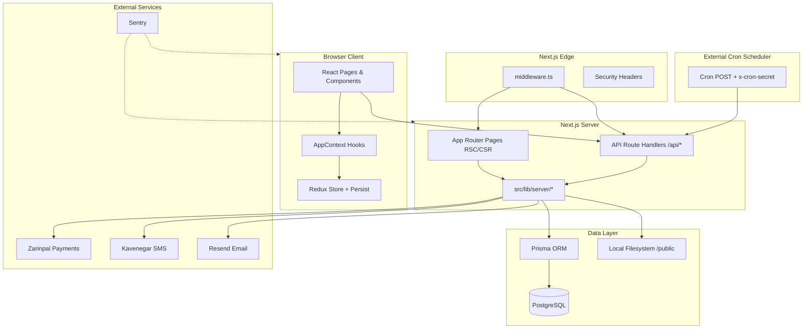
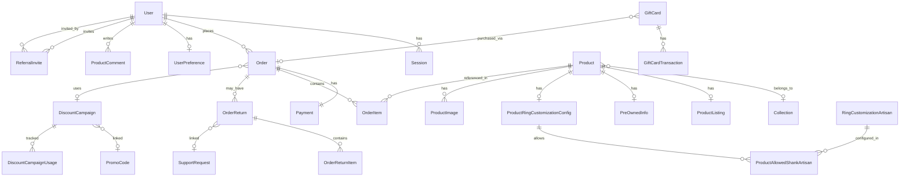
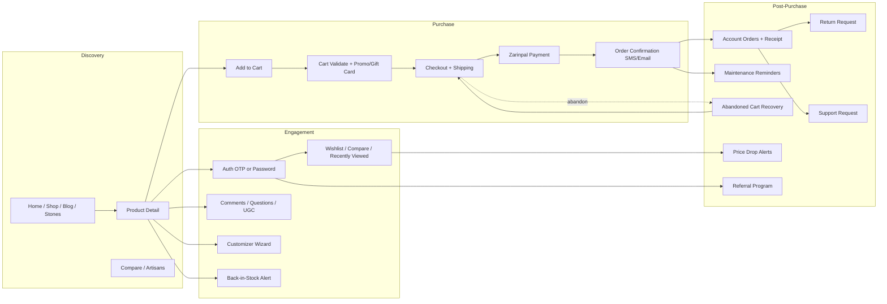

# Niloora — Complete Project Audit

**Generated:** 2026-06-06  
**Stack:** Next.js 14 (App Router) · React 18 · PostgreSQL · Prisma 7 · Redux Toolkit  
**Scope:** Read-only architectural audit — no code changes

---

## Table of Contents

1. [Folder Structure](#1-folder-structure)
2. [Architecture](#2-architecture)
3. [Routing Structure](#3-routing-structure)
4. [Page Classification](#4-page-classification)
5. [Layout Hierarchy](#5-layout-hierarchy)
6. [API Routes](#6-api-routes)
7. [Server Actions](#7-server-actions)
8. [Middleware](#8-middleware)
9. [Authentication Flow](#9-authentication-flow)
10. [Authorization Flow](#10-authorization-flow)
11. [Database Models](#11-database-models)
12. [Database Relationships](#12-database-relationships)
13. [External Integrations](#13-external-integrations)
14. [Payment Integrations](#14-payment-integrations)
15. [Email Integrations](#15-email-integrations)
16. [Storage Integrations](#16-storage-integrations)
17. [Background Jobs](#17-background-jobs)
18. [Cron Jobs](#18-cron-jobs)
19. [Environment Variables](#19-environment-variables)
20. [System Architecture Overview](#20-system-architecture-overview)
21. [Complete Route Map](#21-complete-route-map)
22. [Complete API Map](#22-complete-api-map)
23. [Complete Database Map](#23-complete-database-map)
24. [User Journey Map](#24-user-journey-map)
25. [Admin Journey Map](#25-admin-journey-map)

---

## 1. Folder Structure

```
Niloora/
├── docs/                          # Deployment & operational docs
│   ├── production.md
│   └── project-audit.md           # This file
├── prisma/
│   ├── schema.prisma              # Single source of truth for DB models
│   ├── migrations/                # SQL migration history
│   ├── seed.ts                    # Database seed script
│   └── scripts/                   # Prisma helper scripts
├── public/
│   ├── fonts/                     # Static font assets
│   ├── images/                    # Product catalog images, marketing assets
│   └── uploads/admin-media/       # Runtime admin media store (manifest.json)
├── src/
│   ├── app/                       # Next.js App Router (pages + API)
│   │   ├── (auth)/                # Auth route group (no URL segment)
│   │   ├── account/               # Protected customer account
│   │   ├── admin/                 # Protected admin CMS
│   │   ├── api/                   # REST-style route handlers
│   │   ├── [locale]/              # Placeholder for future i18n routes (empty)
│   │   └── …                      # Public storefront pages
│   ├── components/                # React UI by domain (admin, cart, product, …)
│   ├── fonts/                     # Next.js local font modules
│   ├── lib/                       # Shared logic (client + server)
│   │   ├── server/                # Server-only business logic
│   │   ├── store/                 # Redux slices + persist middleware
│   │   ├── hooks/                 # Client data hooks
│   │   ├── context/               # AppContext composition
│   │   └── …                      # Domain modules (auth, orders, shop, …)
│   ├── styles/                    # Global CSS (Tailwind)
│   ├── types/                     # Shared TypeScript types
│   ├── instrumentation.ts         # Sentry + production env validation
│   └── middleware.ts              # Edge auth + security headers
├── .env.example
├── next.config.mjs
├── package.json
├── prisma.config.ts
├── sentry.*.config.ts
├── tailwind.config.ts
└── vitest.config.ts
```

### `src/lib` Domain Modules

| Directory | Responsibility |
|-----------|----------------|
| `server/` | Prisma access, auth, payments, notifications, order pricing, admin DTOs |
| `store/` | Redux slices: cart, wishlist, auth, promo, customizer, compare, … |
| `hooks/` | Client hooks wrapping API calls and Redux |
| `auth/` | Phone normalization, content-workflow roles, OTP messages |
| `admin/` | Admin navigation definitions and access rules |
| `account/` | Account section routing (hash-based) |
| `orders/`, `cart/`, `checkout/` | Commerce client logic |
| `i18n/` | Locale utilities (`fa`, `en`, `ar`); primary UI is Persian |
| `observability/` | Sentry config, structured logging |
| `seo/` | Metadata, sitemap, robots, canonical URLs |

### `src/components` Domains

`account`, `admin`, `auth`, `blog`, `cart`, `commerce`, `compare`, `customizer`, `gift-cards`, `home`, `layout`, `moderation`, `orders`, `pre-owned`, `product`, `providers`, `sections`, `shop`, `support`, `ui`

---

## 2. Architecture

Niloora is a **full-stack e-commerce platform** for handcrafted jewelry (Persian-first), built on the **Next.js App Router** with a **layered architecture**:

```
┌─────────────────────────────────────────────────────────────────┐
│  Browser (RTL Persian UI, Redux client state, AppContext)       │
├─────────────────────────────────────────────────────────────────┤
│  Next.js Pages (RSC + Client Components)                        │
│  ConditionalLayoutChrome → Header / Footer / MobileBottomNav    │
├─────────────────────────────────────────────────────────────────┤
│  Edge Middleware (session JWT verify, route protection)         │
├─────────────────────────────────────────────────────────────────┤
│  API Route Handlers  (/api/**/route.ts)                         │
│  Thin controllers → src/lib/server/* business logic             │
├─────────────────────────────────────────────────────────────────┤
│  Prisma ORM → PostgreSQL                                        │
├─────────────────────────────────────────────────────────────────┤
│  External: Zarinpal, Kavenegar SMS, Resend Email, Sentry        │
└─────────────────────────────────────────────────────────────────┘
```

### Architectural Decisions

| Pattern | Implementation |
|---------|----------------|
| **Data fetching** | Client hooks → `fetch` → API routes → Prisma |
| **Mutations** | `POST`/`PATCH`/`DELETE` API routes (no Server Actions) |
| **Client state** | Redux Toolkit + `persistMiddleware` (localStorage) |
| **Session** | HTTP-only cookie: `refreshToken.signedAccessJWT` |
| **Pricing authority** | Server-only (`repriceOrderItems`, `createOrderFromCart`) |
| **Admin CMS** | Dedicated `/admin/*` pages + `/api/admin/*` APIs |
| **Observability** | Sentry (`@sentry/nextjs`) + structured `serverLogger` |
| **i18n** | Middleware locale stripping; `fa` default; `en`/`ar` dictionaries exist; `[locale]` route folder is empty |

### Key Dependencies

| Package | Role |
|---------|------|
| `@prisma/client` + `pg` | Database ORM (PostgreSQL) |
| `@reduxjs/toolkit` | Client state management |
| `jose` | JWT signing/verification for access tokens |
| `bcryptjs` | Password hashing |
| `@react-three/fiber` + `three` | 3D ring customizer preview |
| `@sentry/nextjs` | Error monitoring |
| `sharp` | Image optimization (admin media) |
| `xlsx` | Admin CSV/Excel import-export |
| `vitest` | Unit tests |

---

## 3. Routing Structure

Next.js **App Router** file-based routing under `src/app/`.

| Mechanism | Details |
|-----------|---------|
| **Route groups** | `(auth)` — groups auth pages without affecting URL |
| **Dynamic segments** | `[id]`, `[slug]`, `[facet]`, `[pair]`, `[orderId]`, `[locale]` |
| **Redirects** | `next.config.mjs`: `/login` → `/auth`, `/register` → `/auth` (308) |
| **Middleware redirect** | `/dashboard` → `/account` (308) |
| **Locale prefix** | Optional `/{fa\|en\|ar}` prefix stripped in middleware via `stripLocalePrefix` |
| **Legacy account sections** | Hash-based: `/account#orders`, `/account#wishlist`, etc. |
| **Legacy admin sections** | Old `/account#admin-*` hashes redirect to `/admin/*` |

### Route Segment Config

Most API routes export `dynamic` from `@/lib/server/route-segment` (force-dynamic). Admin and account layouts set `export const dynamic = "force-dynamic"`.

---

## 4. Page Classification

### Public Pages (no auth required)

| Route | Purpose |
|-------|---------|
| `/` | Home — sliders, featured products, testimonials |
| `/shop` | Product catalog with filters |
| `/shop/[facet]/[slug]` | Faceted shop URLs (SEO) |
| `/product/[id]` | Product detail page |
| `/cart` | Shopping cart + checkout |
| `/customize` | Ring customizer wizard (3D preview) |
| `/compare` | Product comparison |
| `/compare/stone/[pair]` | Stone pair comparison |
| `/pre-owned` | Pre-owned catalog |
| `/pre-owned/sell` | Trade-in submission form |
| `/gift-cards` | Gift card purchase |
| `/blog` | Published blog listing |
| `/blog/[slug]` | Blog article |
| `/stones` | Gemstone education hub |
| `/stones/[slug]` | Individual stone guide |
| `/artisans` | Artisan directory |
| `/artisans/[slug]` | Artisan profile |
| `/about` | About the atelier |
| `/contact` | Contact page |
| `/faq` | FAQ |
| `/support` | Support information |
| `/returns` | Returns policy |
| `/terms` | Terms of service |
| `/privacy` | Privacy policy |
| `/ring-size` | Ring sizing guide |
| `/guide/buying` | Buying guide |
| `/workshop-transparency` | Workshop transparency |
| `/verify` | Product authenticity verification |
| `/auth` | Unified auth (OTP + password) |
| `/forgot-password` | Password reset flow |
| `/login`, `/register` | Redirect to `/auth` |

### Protected Pages (auth required — middleware + client guard)

| Route | Guard | Purpose |
|-------|-------|---------|
| `/account` | Middleware + `AuthGuard` | Customer dashboard (sections via hash) |
| `/account/orders/[orderId]/receipt` | Middleware + `AuthGuard` | Order receipt |

**Account sections** (hash/query on `/account`):

`overview`, `referrals`, `profile`, `orders`, `quotes`, `ugc`, `wishlist`, `compare`, `recently-viewed`, `designs`

### Admin Pages

| Route | Guard | Access |
|-------|-------|--------|
| `/admin` | Middleware | Redirects to `/admin/orders` |
| `/admin/orders` | `AdminGuard` | `role === admin` |
| `/admin/orders/[orderId]/invoice` | `AdminGuard` | Order invoice |
| `/admin/finance` | `AdminGuard` | Payment ledger |
| `/admin/finance/[id]` | `AdminGuard` | Payment detail |
| `/admin/users` | `AdminGuard` | User management |
| `/admin/products` | `AdminGuard` | Product CRUD |
| `/admin/returns` | `AdminGuard` | Return requests |
| `/admin/returns/[id]` | `AdminGuard` | Return detail |
| `/admin/trade-in` | `AdminGuard` | Trade-in submissions |
| `/admin/support-requests` | `AdminGuard` | Support tickets |
| `/admin/promo-codes` | `AdminGuard` | Promo code management |
| `/admin/campaigns` | `AdminGuard` | Discount campaigns |
| `/admin/bundles` | `AdminGuard` | Bundle offers |
| `/admin/gift-cards` | `AdminGuard` | Gift card management |
| `/admin/customizer-quotes` | `AdminGuard` | Workshop quote requests |
| `/admin/home` | `AdminGuard` | Home page CMS |
| `/admin/ab-tests` | `AdminGuard` | A/B test results |
| `/admin/moderation` | `AdminGuard` | Comments, questions, UGC |
| `/admin/ring-customization` | `AdminGuard` | Ring customization catalog |
| `/admin/back-in-stock-alerts` | `AdminGuard` | Stock alert queue |
| `/admin/media` | `AdminGuard` | Media asset manager |
| `/admin/audit-logs` | `AdminGuard` | Admin audit trail |
| `/admin/settings` | `AdminGuard` | Site settings |
| `/admin/posts` | `ContentWorkflowGuard` | Blog CMS (`admin`, `editor`, `reviewer`) |

### Deprecated / Alias Routes

| Route | Behavior |
|-------|----------|
| `/dashboard` | 308 redirect → `/account` |

---

## 5. Layout Hierarchy

```
RootLayout (src/app/layout.tsx)
├── html[lang=fa, dir=rtl]
├── MotionOffProvider
├── StoreProvider (Redux)
├── AppProvider (domain hooks composition)
├── SiteSettingsProvider
├── DiscountCountdownProvider
├── ConditionalLayoutChrome
│   ├── [Auth pages] → bare <main> (no header/footer)
│   ├── [Home] → Header + content + Footer(desktop) + MobileBottomNav
│   └── [Other public] → Header + site-shell + Footer(desktop) + MobileBottomNav
├── AppToaster
├── PersianDigitsEnforcer
└── ClientObservability (Sentry client)

(auth)/layout.tsx          → passthrough fragment
account/layout.tsx         → passthrough (force-dynamic)
admin/layout.tsx           → AdminSidebar + admin-shell (force-dynamic)
about/layout.tsx           → about-specific wrapper
customize/layout.tsx       → passthrough (force-dynamic)
```

**ConditionalLayoutChrome** hides header/footer on auth pages and applies different padding on home vs. inner pages.

---

## 6. API Routes

**112 route handlers** under `src/app/api/**/route.ts`. Business logic lives in `src/lib/server/*`; handlers are thin controllers.

See [Complete API Map](#22-complete-api-map) for the full listing.

### API Auth Tiers

| Tier | Protection |
|------|------------|
| **Public** | No session (products, home, posts, health, …) |
| **Optional session** | Guest checkout resolves user from shipping phone |
| **Session required** | `readSessionUser()` → 401 (orders, account, preferences, …) |
| **Admin API** | Middleware JWT check + `ensureAdmin` in handler |
| **Content workflow API** | Middleware allows `admin`/`editor`/`reviewer` for `/api/admin/posts*` |
| **Cron** | `x-cron-secret` header matching `ABANDONED_CART_CRON_SECRET` |

---

## 7. Server Actions

**None.** The codebase does not use `"use server"` directives. All server mutations go through **API Route Handlers** (`route.ts`).

---

## 8. Middleware

**File:** `src/middleware.ts`

### Responsibilities

1. **Locale stripping** — `stripLocalePrefix` for `fa`/`en`/`ar` URL prefixes
2. **Dashboard redirect** — `/dashboard` → `/account` (308)
3. **Session verification** — `getEdgeSessionFromRequest` (JWT in cookie)
4. **Route protection:**
   - `/account/*` → redirect to `/auth?redirect=…` if no session
   - `/admin/*` (except `/admin/posts`) → require `role === admin`
   - `/admin/posts` → require content workflow role
   - `/api/admin/*` → 401/403 JSON responses
5. **Security headers** — `applySecurityHeaders` on all matched responses

### Matcher

```typescript
[
  "/account", "/account/:path*",
  "/admin/:path*",
  "/dashboard", "/dashboard/:path*",
  "/api/admin/:path*",
  "/((?!_next/static|_next/image|favicon.ico|.*\\.(?:svg|png|jpg|jpeg|gif|webp|ico|woff2?)$).*)",
]
```

---

## 9. Authentication Flow

### Session Model

```
Cookie: niloora_session = <rawRefreshToken>.<signedAccessJWT>

Access JWT  → short-lived (24h), HS256, signed with SESSION_SECRET
Refresh token → SHA-256 hashed, stored in Session table (30-day TTL default)
```

### Login Methods

| Method | Endpoints | Flow |
|--------|-----------|------|
| **OTP (primary)** | `POST /api/auth/otp/request` → `POST /api/auth/otp/verify` | Kavenegar SMS in production; creates user on first verify |
| **Password** | `POST /api/auth/login` | Phone + bcrypt password compare |
| **Register** | `POST /api/auth/register` | Phone + password + name → session |
| **Password reset** | `POST /api/auth/forgot-password/request` → `POST /api/auth/forgot-password/reset` | Token via SMS |

### Session Lifecycle

```
1. Login/OTP verify → createSession(userId)
   → INSERT Session row (refresh hash + expiry)
   → SET cookie (httpOnly, secure in production)

2. GET /api/auth/session → readSessionUser()
   → Verify access JWT OR refresh via DB session row
   → Return session-safe user DTO

3. POST /api/auth/logout → destroy session row + clear cookie

4. Client: useAuth hook → Redux authSlice → loadSession on hydrate
```

### OTP Security

- Rate limiting: `assertOtpVerifyRateLimit` / OTP request limits
- Codes stored hashed in `OtpVerificationCode` with TTL (`OTP_TTL_MINUTES`, default 3)
- Max attempts before lockout

### Guest Checkout

`resolveCheckoutUser` in payment flow can create/link a user from shipping phone during `POST /api/payments/zarinpal/request`.

---

## 10. Authorization Flow

### Roles

| Role | Capabilities |
|------|-------------|
| `user` | Default; account, orders, UGC, comments |
| `editor` | Create/edit blog posts (draft → review) |
| `reviewer` | Review/publish blog posts (review ↔ published) |
| `admin` | Full admin CMS + all `/api/admin/*` except posts use workflow guards too |

### Defense Layers

```
Layer 1: Edge Middleware
  ├── /account, /admin pages → session required
  ├── /api/admin/* → session + role check
  └── /admin/posts → content workflow roles

Layer 2: Client Guards
  ├── AuthGuard → account pages
  ├── AdminGuard → admin pages (admin only)
  └── ContentWorkflowGuard → admin/posts (admin/editor/reviewer)

Layer 3: API Route Guards
  ├── ensureAdmin(user) → 401/403
  ├── ensureContentWorkflowAccess(user)
  └── readSessionUser() per-endpoint

Layer 4: Content Workflow Rules
  └── canTransitionPostStatus, canCreateContent, canDeleteContent
```

### Blocked Users

`user.blocked === true` → OTP verify returns 403; login should be blocked at credential check.

---

## 11. Database Models

**Provider:** PostgreSQL via Prisma 7 (`@prisma/adapter-pg`)

### Model Inventory (37 models)

| Domain | Models |
|--------|--------|
| **Auth & Users** | `User`, `Session`, `PasswordResetToken`, `OtpVerificationCode`, `UserPreference`, `PriceDropUnsubscribeToken` |
| **Catalog** | `Product`, `ProductImage`, `ProductListing`, `PreOwnedInfo`, `Collection`, `ProductRingCustomizationConfig` |
| **Ring Customization** | `RingCustomizationArtisan`, `RingCustomizationShankPattern`, `RingCustomizationStoneText`, `RingCustomizationScriptStyle`, `ProductAllowedShankArtisan`, `ProductAllowedShankPattern`, `ProductAllowedStoneArtisan`, `ProductAllowedStoneText`, `ProductAllowedScriptStyle`, `StoneTextAllowedScript` |
| **Commerce** | `Order`, `OrderItem`, `Payment`, `PaymentLog`, `PromoCode`, `DiscountCampaign`, `DiscountCampaignUsage`, `BundleOffer`, `GiftCard`, `GiftCardTransaction` |
| **Returns & Support** | `OrderReturn`, `OrderReturnItem`, `OrderReturnStatusHistory`, `SupportRequest`, `TradeInSubmission` |
| **UGC & Social** | `ProductComment`, `ProductQuestion`, `ProductQuestionAnswer`, `ProductUgcMedia`, `ProductAuthenticityVerification` |
| **Marketing & Home** | `HomeSliderItem`, `HomeBannerSettings`, `HomeTestimonial`, `HomeInstagramPost`, `Post` |
| **Notifications & Journeys** | `OrderNotification`, `AutomatedJourneyEvent`, `MaintenanceReminder`, `BackInStockAlert`, `AbandonedCartRecovery` |
| **Referral & Loyalty** | `ReferralInvite` (self-referential on `User`) |
| **Customizer** | `CustomizerQuoteRequest` |
| **Site Config** | `SiteSettings` |
| **Audit** | `AdminAuditLog` |

---

## 12. Database Relationships

### Core Entity Graph

```
User
├── 1:N Session, PasswordResetToken, Order, SupportRequest, OrderReturn
├── 1:N ProductComment, ProductQuestion, ProductQuestionAnswer, ProductUgcMedia
├── 1:N BackInStockAlert, AbandonedCartRecovery, AutomatedJourneyEvent
├── 1:N MaintenanceReminder, DiscountCampaignUsage, CustomizerQuoteRequest
├── 1:1 UserPreference
├── 1:N ReferralInvite (as inviter + invitee)
├── self-ref: referredBy → User (referral tree)
└── 1:N GiftCard (as purchaser)

Product
├── N:1 Collection (optional)
├── 1:1 ProductListing, PreOwnedInfo, ProductRingCustomizationConfig
├── 1:N ProductImage, OrderItem, ProductComment, ProductQuestion
├── 1:N ProductUgcMedia, BackInStockAlert, HomeSliderItem
└── 1:N ProductAuthenticityVerification

Order
├── N:1 User, DiscountCampaign (optional)
├── 1:1 Payment, GiftCard (if gift-card order)
├── 1:N OrderItem, OrderNotification, OrderReturn, GiftCardTransaction
├── 1:N ProductUgcMedia, SupportRequest, AutomatedJourneyEvent
├── 1:N MaintenanceReminder, DiscountCampaignUsage
└── fields: promo, gift card, loyalty, bundle, campaign discounts

OrderReturn
├── N:1 Order, User (optional), SupportRequest (optional 1:1)
├── 1:N OrderReturnItem, OrderReturnStatusHistory
└── links to OrderItem via OrderReturnItem

Payment
├── 1:1 Order
└── 1:N PaymentLog

DiscountCampaign
├── N:1 PromoCode (optional linked)
├── 1:N Order, DiscountCampaignUsage
└── JSON targets: productIds, collectionIds

GiftCard
├── N:1 User (purchaser), Order (optional)
└── 1:N GiftCardTransaction

ProductRingCustomizationConfig
├── 1:1 Product
└── M:N via join tables to artisans, patterns, texts, script styles

Post (blog)
└── standalone with status workflow (draft/review/published)
```

### Cascade Behavior

Most child records use `onDelete: Cascade` from parent `User`, `Product`, `Order`. Optional FKs use `SetNull` (e.g., `OrderItem.productId`, `Order.campaignId`).

---

## 13. External Integrations

| Service | Purpose | Module |
|---------|---------|--------|
| **PostgreSQL** | Primary database | `src/lib/server/prisma.ts` |
| **Zarinpal** | Payment gateway (Iran) | `src/lib/server/payment/zarinpal.ts` |
| **Kavenegar** | SMS OTP + transactional SMS | `src/lib/server/sms/kavenegar.ts` |
| **Resend** | Transactional email | `src/lib/server/notifications/email/resend.ts` |
| **Sentry** | Error monitoring + performance | `src/instrumentation.ts`, `sentry.*.config.ts` |

### Notification Events

| Event | Trigger |
|-------|---------|
| OTP | Auth OTP request |
| Order placed/shipped/tracking | Payment callback + admin order update |
| Welcome journey | New user registration |
| Birthday / winback / order followup | Cron `messaging-journeys` |
| Maintenance reminders | +45d polish, +90d stone check after paid order |
| Price drop alerts | Cron compares wishlist baseline prices |
| Abandoned cart | Cron `abandoned-cart-recovery` |
| Back-in-stock | Admin notify endpoint |

---

## 14. Payment Integrations

### Provider: Zarinpal

| Aspect | Detail |
|--------|--------|
| **Config source** | `ZARINPAL_MERCHANT_ID` env OR `SiteSettings.zarinpalMerchantId` (DB override) |
| **Sandbox** | `ZARINPAL_SANDBOX` env (default `true`) OR `SiteSettings.zarinpalSandbox` |
| **Currency** | Site prices in Toman; gateway expects Rial (`×10`) |
| **Initiate** | `POST /api/payments/zarinpal/request` |
| **Callback** | `GET /api/payments/zarinpal/callback` (Authority + Status params) |
| **BNPL** | `paymentMethod: "bnpl"` with installment months (eligibility validated server-side) |

### Payment Flow

```
Cart checkout
  → POST /api/payments/zarinpal/request
    → repriceOrderItems (server-authoritative pricing)
    → createOrderFromCart (status: pending_payment)
    → zarinpalRequestPayment → redirect URL
  → User pays on Zarinpal
  → GET /api/payments/zarinpal/callback
    → zarinpalVerifyPayment
    → order status → processing
    → notifyOrderPlaced (SMS/email)
    → rewardReferralOnPaidOrder, rewardLoyaltyOnPaidOrder
    → scheduleOrderMaintenanceReminders
    → consumeGiftCardForOrder (if applicable)
```

`POST /api/orders` is **disabled** — orders are only created through the payment request flow.

---

## 15. Email Integrations

### Provider: Resend

| Variable | Purpose |
|----------|---------|
| `NOTIFY_EMAIL_ENABLED` | Must be `true` to enable |
| `RESEND_API_KEY` | API authentication |
| `RESEND_FROM_EMAIL` | Verified sender address |

**Module:** `src/lib/server/notifications/email/resend.ts`

In development (`NODE_ENV !== production`), emails are logged as `[notify:email:preview]` without calling Resend.

---

## 16. Storage Integrations

### Local Filesystem (no cloud storage)

| Store | Path | Purpose |
|-------|------|---------|
| **Admin media** | `public/uploads/admin-media/` | Uploaded images with `manifest.json` index |
| **Product images** | `public/images/products/` | Static catalog import images |
| **Fonts** | `public/fonts/`, `src/fonts/` | Web fonts |

Admin media upload uses **Sharp** for WebP derivative generation. Managed via `GET|POST /api/admin/media` and `DELETE /api/admin/media/[id]`.

**No S3, Cloudinary, or blob storage integration** is present in the codebase.

---

## 17. Background Jobs

Niloora has **no in-process job queue** (no Bull, BullMQ, pg-boss, etc.). Background work is triggered by:

1. **HTTP cron endpoints** (external scheduler invokes POST)
2. **Synchronous side effects** in payment callback (notifications, loyalty, referrals)
3. **Fire-and-forget queuing** in notification modules (e.g., `queueWelcomeJourney`)

---

## 18. Cron Jobs

Both cron endpoints require:

```http
POST /api/cron/*
x-cron-secret: <ABANDONED_CART_CRON_SECRET>
```

### `POST /api/cron/abandoned-cart-recovery`

| Setting | Default |
|---------|---------|
| Enabled | `ABANDONED_CART_ENABLED=true` |
| Delay | `ABANDONED_CART_REMINDER_DELAY_MINUTES=120` |
| Batch size | 300 rows per run |

Processes `AbandonedCartRecovery` rows where `status=pending` and `nextReminderAt <= now`. Sends SMS/email with recovery link.

**Suggested schedule:** every 15–30 minutes.

### `POST /api/cron/messaging-journeys`

Runs in parallel:

| Journey | Function |
|---------|----------|
| `birthday` | `runBirthdayJourneys` |
| `winback` | `runWinbackJourneys` |
| `orderFollowup` | `runOrderFollowupJourneys` |
| `maintenance` | `runMaintenanceReminderJourneys` |
| `priceDrop` | `runPriceDropAlerts` |

Requires `NOTIFY_ENABLED=true`.

**Suggested schedule:** once daily (e.g., 09:00 Asia/Tehran).

---

## 19. Environment Variables

### Required (production runtime)

| Variable | Purpose |
|----------|---------|
| `DATABASE_URL` | PostgreSQL connection string |
| `SESSION_SECRET` | JWT signing + session security |
| `NEXT_PUBLIC_SITE_URL` | Canonical URL (or `NEXT_PUBLIC_APP_URL` / `APP_URL`) |
| `ABANDONED_CART_CRON_SECRET` | Cron endpoint authentication |

### Auth

| Variable | Default | Purpose |
|----------|---------|---------|
| `OTP_TTL_MINUTES` | `3` | OTP code expiry |
| `SESSION_MAX_AGE_DAYS` | `30` | Refresh token lifetime |
| `RESET_TOKEN_TTL_MINUTES` | `30` | Password reset token TTL |

### SMS (Kavenegar)

| Variable | Required (prod) | Purpose |
|----------|-----------------|---------|
| `SMS_PROVIDER` | — | Default `kavenegar` |
| `KAVENEGAR_API_KEY` | Yes* | API key |
| `KAVENEGAR_OTP_TEMPLATE` | Yes* | Verify Lookup template |
| `KAVENEGAR_SENDER` | No | Plain SMS sender line |
| `KAVENEGAR_TEMPLATE_ORDER_PLACED` | No | Order placed Lookup |
| `KAVENEGAR_TEMPLATE_ORDER_SHIPPED` | No | Order shipped Lookup |

\*When `NOTIFY_ENABLED=true` (default)

### Payments (Zarinpal)

| Variable | Default | Purpose |
|----------|---------|---------|
| `ZARINPAL_MERCHANT_ID` | — | Merchant ID (or DB site settings) |
| `ZARINPAL_SANDBOX` | `true` | Sandbox mode |

### Email (Resend)

| Variable | Purpose |
|----------|---------|
| `NOTIFY_ENABLED` | Master notification toggle (default `true`) |
| `NOTIFY_EMAIL_ENABLED` | Enable email channel |
| `RESEND_API_KEY` | Resend API key |
| `RESEND_FROM_EMAIL` | Sender address |

### Abandoned Cart

| Variable | Default | Purpose |
|----------|---------|---------|
| `ABANDONED_CART_ENABLED` | `true` | Feature toggle |
| `ABANDONED_CART_REMINDER_DELAY_MINUTES` | `120` | Reminder delay |

### Observability (Sentry)

| Variable | Purpose |
|----------|---------|
| `SENTRY_ENABLED` | Set `false` to disable |
| `SENTRY_DSN` / `NEXT_PUBLIC_SENTRY_DSN` | Error reporting |
| `SENTRY_ENVIRONMENT` | Environment tag |
| `SENTRY_TRACES_SAMPLE_RATE` | Performance sampling (default `0.1`) |
| `SENTRY_ORG`, `SENTRY_PROJECT`, `SENTRY_AUTH_TOKEN` | Source map upload (build) |
| `SENTRY_TUNNEL_ROUTE` | Tunnel path (default `/monitoring`) |
| `SENTRY_RELEASE` | Release identifier |

### Health Check

| Variable | Purpose |
|----------|---------|
| `HEALTH_CHECK_SECRET` | Protects `GET /api/health?detailed=1` |

### Build / Runtime (automatic)

| Variable | Purpose |
|----------|---------|
| `NODE_ENV` | `development` / `production` |
| `NEXT_RUNTIME` | `nodejs` / `edge` (instrumentation) |
| `NEXT_PHASE` | Build phase detection |
| `VERCEL_ENV`, `VERCEL_GIT_COMMIT_SHA` | Vercel deployment metadata |

---

## 20. System Architecture Overview



### Request Flow (Typical Page Load)

1. Browser requests page → Middleware applies security headers (and auth check if protected)
2. Root layout loads site settings from DB → wraps children in providers
3. Page component renders (client or server)
4. Client hooks fetch data from `/api/*` endpoints
5. API handler validates session → calls `src/lib/server` → Prisma → JSON response

### Checkout Flow (Critical Path)

1. User builds cart in Redux (persisted to `UserPreference` when logged in)
2. `POST /api/cart/validate` — server validates purchasability
3. `POST /api/payments/zarinpal/request` — server reprices, creates pending order
4. Redirect to Zarinpal → payment → callback verifies → order finalized
5. Notifications, loyalty, referral rewards triggered synchronously

---

## 21. Complete Route Map

### Public Storefront

| Method | Path | Dynamic Params |
|--------|------|----------------|
| GET | `/` | — |
| GET | `/shop` | — |
| GET | `/shop/[facet]/[slug]` | facet, slug |
| GET | `/product/[id]` | id |
| GET | `/cart` | — |
| GET | `/customize` | — |
| GET | `/compare` | — |
| GET | `/compare/stone/[pair]` | pair |
| GET | `/pre-owned` | — |
| GET | `/pre-owned/sell` | — |
| GET | `/gift-cards` | — |
| GET | `/blog` | — |
| GET | `/blog/[slug]` | slug |
| GET | `/stones` | — |
| GET | `/stones/[slug]` | slug |
| GET | `/artisans` | — |
| GET | `/artisans/[slug]` | slug |
| GET | `/about` | — |
| GET | `/contact` | — |
| GET | `/faq` | — |
| GET | `/support` | — |
| GET | `/returns` | — |
| GET | `/terms` | — |
| GET | `/privacy` | — |
| GET | `/ring-size` | — |
| GET | `/guide/buying` | — |
| GET | `/workshop-transparency` | — |
| GET | `/verify` | — |

### Auth

| Method | Path | Notes |
|--------|------|-------|
| GET | `/auth` | Unified login/register (OTP) |
| GET | `/forgot-password` | Password reset |
| GET | `/login` | 308 → `/auth` |
| GET | `/register` | 308 → `/auth` |

### Protected (Customer)

| Method | Path | Notes |
|--------|------|-------|
| GET | `/account` | Section via `#hash` or `?section=` |
| GET | `/account/orders/[orderId]/receipt` | orderId |

### Admin

| Method | Path | Access |
|--------|------|--------|
| GET | `/admin` | Redirect → `/admin/orders` |
| GET | `/admin/orders` | admin |
| GET | `/admin/orders/[orderId]/invoice` | admin |
| GET | `/admin/finance` | admin |
| GET | `/admin/finance/[id]` | admin |
| GET | `/admin/users` | admin |
| GET | `/admin/products` | admin |
| GET | `/admin/returns` | admin |
| GET | `/admin/returns/[id]` | admin |
| GET | `/admin/trade-in` | admin |
| GET | `/admin/support-requests` | admin |
| GET | `/admin/promo-codes` | admin |
| GET | `/admin/campaigns` | admin |
| GET | `/admin/bundles` | admin |
| GET | `/admin/gift-cards` | admin |
| GET | `/admin/customizer-quotes` | admin |
| GET | `/admin/home` | admin |
| GET | `/admin/ab-tests` | admin |
| GET | `/admin/moderation` | admin |
| GET | `/admin/ring-customization` | admin |
| GET | `/admin/back-in-stock-alerts` | admin |
| GET | `/admin/media` | admin |
| GET | `/admin/audit-logs` | admin |
| GET | `/admin/settings` | admin |
| GET | `/admin/posts` | admin / editor / reviewer |

### Redirects & SEO

| Resource | Path |
|----------|------|
| Sitemap | `/sitemap.xml` (`src/app/sitemap.ts`) |
| Robots | `/robots.txt` (`src/app/robots.ts`) |
| Sentry tunnel | `/monitoring` (configurable) |

---

## 22. Complete API Map

### Health

| Method | Path | Auth |
|--------|------|------|
| GET | `/api/health` | Public (detailed mode may need `x-health-secret`) |

### Auth

| Method | Path | Auth |
|--------|------|------|
| POST | `/api/auth/login` | Public |
| POST | `/api/auth/register` | Public |
| POST | `/api/auth/logout` | Session |
| GET | `/api/auth/session` | Session (optional) |
| POST | `/api/auth/otp/request` | Public |
| POST | `/api/auth/otp/verify` | Public |
| POST | `/api/auth/forgot-password/request` | Public |
| POST | `/api/auth/forgot-password/reset` | Public |

### Account & Preferences

| Method | Path | Auth |
|--------|------|------|
| GET | `/api/account` | Session |
| PATCH | `/api/account` | Session |
| GET | `/api/user/preferences` | Session |
| PUT | `/api/user/preferences` | Session |

### Catalog & Products

| Method | Path | Auth |
|--------|------|------|
| GET | `/api/products` | Public |
| GET | `/api/products/search` | Public |
| GET | `/api/products/[id]` | Public |
| GET | `/api/products/pre-owned` | Public |
| GET | `/api/products/sales` | Public |
| GET | `/api/products/[id]/ring-customization` | Public |
| GET | `/api/collections` | Public |
| GET | `/api/authenticity/verify` | Public |
| POST | `/api/ring-customization/price-preview` | Public |

### Cart & Checkout

| Method | Path | Auth |
|--------|------|------|
| POST | `/api/cart/validate` | Public |
| POST | `/api/cart/sanitize` | Public |
| POST | `/api/promo/validate` | Public |
| POST | `/api/gift-cards/validate` | Public |
| GET | `/api/gift-cards/balance` | Public |
| POST | `/api/gift-cards/purchase` | Session |
| GET | `/api/bundles/active` | Public |
| GET | `/api/campaigns/active` | Public |
| GET | `/api/campaigns/[slug]` | Public |
| GET | `/api/discounts/countdown` | Public |

### Orders & Payments

| Method | Path | Auth |
|--------|------|------|
| GET | `/api/orders` | Session |
| POST | `/api/orders` | Disabled |
| GET | `/api/orders/[id]` | Session |
| POST | `/api/payments/zarinpal/request` | Session or guest |
| GET | `/api/payments/zarinpal/callback` | Public (gateway) |

### Returns & Support

| Method | Path | Auth |
|--------|------|------|
| GET | `/api/returns` | Session |
| POST | `/api/returns` | Session |
| POST | `/api/support-requests` | Optional session |
| POST | `/api/trade-in` | Public |

### Customizer

| Method | Path | Auth |
|--------|------|------|
| GET | `/api/customizer/quote-requests` | Session |
| POST | `/api/customizer/quote-requests` | Session |

### UGC, Comments, Questions

| Method | Path | Auth |
|--------|------|------|
| GET | `/api/ugc` | Public |
| POST | `/api/ugc` | Session |
| GET | `/api/ugc/my` | Session |
| GET | `/api/comments` | Public |
| POST | `/api/comments` | Session |
| GET | `/api/comments/pending` | Admin |
| PATCH | `/api/comments/[id]` | Admin |
| GET | `/api/product-questions` | Public |
| POST | `/api/product-questions` | Session |
| PATCH | `/api/product-questions/[id]` | Admin |
| POST | `/api/product-questions/[id]/answers` | Session |
| PATCH | `/api/product-questions/answers/[id]` | Admin |
| GET | `/api/product-questions/pending` | Admin |

### Home & Content

| Method | Path | Auth |
|--------|------|------|
| GET | `/api/home` | Public |
| GET | `/api/home/banner` | Public |
| GET | `/api/posts` | Public |
| GET | `/api/posts/[slug]` | Public |
| GET | `/api/site-settings` | Public |

### Marketing & Analytics

| Method | Path | Auth |
|--------|------|------|
| GET | `/api/referrals/summary` | Session |
| POST | `/api/abandoned-cart` | Public |
| POST | `/api/abandoned-cart/recover` | Public |
| GET | `/api/price-drop/unsubscribe` | Public (token) |
| POST | `/api/back-in-stock-alerts` | Public |
| POST | `/api/ab/events` | Public |
| POST | `/api/analytics/funnel` | Public |

### Cron

| Method | Path | Auth |
|--------|------|------|
| POST | `/api/cron/abandoned-cart-recovery` | `x-cron-secret` |
| POST | `/api/cron/messaging-journeys` | `x-cron-secret` |

### Admin APIs

| Method | Path | Auth |
|--------|------|------|
| GET | `/api/admin/users` | Admin |
| GET | `/api/admin/users/[id]` | Admin |
| PATCH | `/api/admin/users/[id]` | Admin |
| GET | `/api/admin/orders` | Admin |
| GET | `/api/admin/orders/[id]` | Admin |
| PATCH | `/api/admin/orders/[id]` | Admin |
| GET, POST | `/api/admin/orders/csv` | Admin |
| GET | `/api/admin/finance` | Admin |
| GET | `/api/admin/finance/[id]` | Admin |
| GET | `/api/admin/finance/csv` | Admin |
| GET, POST | `/api/admin/products` | Admin |
| GET, PATCH, DELETE | `/api/admin/products/[id]` | Admin |
| PATCH | `/api/admin/products/bulk` | Admin |
| GET, POST | `/api/admin/products/csv` | Admin |
| GET, PATCH | `/api/admin/products/[id]/ring-customization` | Admin |
| GET | `/api/admin/collections` | Admin |
| GET, POST | `/api/admin/promo-codes` | Admin |
| PATCH, DELETE | `/api/admin/promo-codes/[id]` | Admin |
| GET, POST | `/api/admin/promo-codes/csv` | Admin |
| GET, POST | `/api/admin/campaigns` | Admin |
| GET, PATCH, DELETE | `/api/admin/campaigns/[id]` | Admin |
| GET, POST | `/api/admin/bundles` | Admin |
| PATCH, DELETE | `/api/admin/bundles/[id]` | Admin |
| GET, POST | `/api/admin/gift-cards` | Admin |
| PATCH | `/api/admin/gift-cards/[id]` | Admin |
| GET | `/api/admin/returns` | Admin |
| POST | `/api/admin/returns` | Admin |
| GET, PATCH | `/api/admin/returns/[id]` | Admin |
| GET | `/api/admin/trade-in` | Admin |
| PATCH | `/api/admin/trade-in/[id]` | Admin |
| GET | `/api/admin/support-requests` | Admin |
| PATCH | `/api/admin/support-requests/[id]` | Admin |
| GET | `/api/admin/customizer/quote-requests` | Admin |
| PATCH | `/api/admin/customizer/quote-requests/[id]` | Admin |
| GET, PATCH | `/api/admin/ring-customization/catalog` | Admin |
| GET | `/api/admin/back-in-stock-alerts` | Admin |
| POST | `/api/admin/back-in-stock-alerts/notify` | Admin |
| GET, POST | `/api/admin/home/banner` | Admin |
| GET, POST | `/api/admin/home/slider` | Admin |
| PATCH, DELETE | `/api/admin/home/slider/[id]` | Admin |
| GET, POST | `/api/admin/home/testimonials` | Admin |
| PATCH, DELETE | `/api/admin/home/testimonials/[id]` | Admin |
| GET, POST | `/api/admin/home/instagram` | Admin |
| PATCH, DELETE | `/api/admin/home/instagram/[id]` | Admin |
| GET | `/api/admin/home/kpi` | Admin |
| GET, POST | `/api/admin/posts` | Content workflow |
| PATCH, DELETE | `/api/admin/posts/[id]` | Content workflow |
| GET | `/api/admin/ugc/pending` | Admin |
| PATCH | `/api/admin/ugc/[id]` | Admin |
| GET, POST | `/api/admin/media` | Admin |
| DELETE | `/api/admin/media/[id]` | Admin |
| GET | `/api/admin/audit-logs` | Admin |
| GET | `/api/admin/ab-tests/results` | Admin |
| GET, PATCH | `/api/admin/site-settings` | Admin |

---

## 23. Complete Database Map

### Entity-Relationship Summary



### Indexes & Constraints (Notable)

| Model | Constraint |
|-------|------------|
| `User.phone` | Unique |
| `User.referralCode` | Unique |
| `Payment.authority` | Unique |
| `Payment.orderId` | Unique (1:1) |
| `GiftCard.code` | Unique |
| `PromoCode.code` | Unique |
| `DiscountCampaign.slug` | Unique |
| `Post.slug` | Unique |
| `BackInStockAlert` | Unique `[productId, channel, contact]` |
| `AbandonedCartRecovery` | Unique `[channel, contact]`, Unique `token` |
| `OrderNotification` | Unique `[orderId, kind, channel]` |
| `AutomatedJourneyEvent` | Unique `[journey, channel, fingerprint]` |
| `MaintenanceReminder` | Unique `[orderId, kind, channel]` |

### JSON Columns

| Model | Field | Content |
|-------|-------|---------|
| `ProductListing` | `details`, `extraTags` | Listing metadata |
| `Order` | `appliedBundles` | Bundle discount snapshot |
| `OrderItem` | `customizerState`, `ringPurchaseCustomization` | Customization config |
| `BundleOffer` | `requiredProductIds` | Product ID array |
| `DiscountCampaign` | `targetProductIds`, `targetCollectionIds` | Targeting |
| `PromoCode` | `aliases` | Code aliases |
| `CustomizerQuoteRequest` | `configuration` | Wizard state |
| `AbandonedCartRecovery` | `cartSnapshot`, `shippingSnapshot` | Cart state |
| `UserPreference` | `cartItems`, `wishlistIds`, etc. | Client state sync |
| `PaymentLog` | `meta` | Event metadata |

---

## 24. User Journey Map



### Journey Steps (Detailed)

| Phase | Steps | Touchpoints |
|-------|-------|-------------|
| **1. Discover** | Land on home → browse shop/stones/blog → view product | `/`, `/shop`, `/product/[id]`, `/api/home`, `/api/products` |
| **2. Evaluate** | Compare products/stones → read reviews → verify authenticity | `/compare`, `/verify`, `/api/comments`, `/api/authenticity/verify` |
| **3. Authenticate** | OTP login (primary) or password → session cookie set | `/auth`, `/api/auth/otp/*`, `/api/auth/session` |
| **4. Personalize** | Wishlist, saved designs, ring customizer, quote request | `/customize`, `/account#designs`, `/api/customizer/quote-requests` |
| **5. Purchase** | Cart → validate → apply promo/gift card → pay via Zarinpal | `/cart`, `/api/cart/validate`, `/api/payments/zarinpal/*` |
| **6. Track** | View orders, download receipt, request return | `/account#orders`, `/api/orders`, `/api/returns` |
| **7. Retain** | Referrals, loyalty points, price-drop alerts, winback SMS | `/account#referrals`, `/api/referrals/summary`, cron journeys |

---

## 25. Admin Journey Map

```mermaid
flowchart TB
    subgraph Access["Access Control"]
        AD1[Login as admin]
        AD2[Middleware + AdminGuard]
    end

    subgraph Operations["Daily Operations"]
        OP1[Orders: status, tracking, invoice]
        OP2[Finance: payment ledger]
        OP3[Returns & Support Requests]
        OP4[Users: roles, block]
    end

    subgraph Catalog["Catalog Management"]
        CAT1[Products CRUD + CSV import]
        CAT2[Ring Customization Catalog]
        CAT3[Collections]
        CAT4[Pre-owned / Trade-in]
    end

    subgraph Marketing["Marketing & Promotions"]
        MKT1[Promo Codes + Campaigns]
        MKT2[Bundles + Gift Cards]
        MKT3[Home CMS: slider, banner, testimonials]
        MKT4[Back-in-Stock Alerts]
    end

    subgraph Content["Content & Moderation"]
        CON1[Blog Posts - workflow roles]
        CON2[Moderation: comments, questions, UGC]
        CON3[Media Manager]
    end

    subgraph Insights["Insights & Config"]
        INS1[KPI Dashboard + A/B Tests]
        INS2[Audit Logs]
        INS3[Site Settings: payment, SMS, brand]
        INS4[Customizer Quote Responses]
    end

    AD1 --> AD2
    AD2 --> OP1 & OP2 & OP3 & OP4
    AD2 --> CAT1 & CAT2 & CAT3 & CAT4
    AD2 --> MKT1 & MKT2 & MKT3 & MKT4
    AD2 --> CON1 & CON2 & CON3
    AD2 --> INS1 & INS2 & INS3 & INS4
```



### Admin Workflow Details

| Area | Admin Pages | Key APIs | Actions |
|------|-------------|----------|---------|
| **Orders** | `/admin/orders`, invoice | `/api/admin/orders/*` | Update status, tracking, export CSV |
| **Finance** | `/admin/finance`, `[id]` | `/api/admin/finance/*` | View payments, export transactions |
| **Products** | `/admin/products` | `/api/admin/products/*` | CRUD, bulk update, CSV import/export |
| **Returns** | `/admin/returns`, `[id]` | `/api/admin/returns/*` | Process return requests |
| **Users** | `/admin/users` | `/api/admin/users/*` | View/edit roles, block users |
| **Promotions** | promo-codes, campaigns, bundles | `/api/admin/promo-codes/*`, campaigns, bundles | Create discounts |
| **Gift Cards** | `/admin/gift-cards` | `/api/admin/gift-cards/*` | Issue/manage cards |
| **Home CMS** | `/admin/home` | `/api/admin/home/*` | Slider, banner, testimonials, Instagram |
| **Blog** | `/admin/posts` | `/api/admin/posts/*` | Draft → review → publish workflow |
| **Moderation** | `/admin/moderation` | comments, questions, UGC APIs | Approve/reject user content |
| **Customizer** | quotes, ring-customization | `/api/admin/customizer/*`, ring catalog | Quote responses, catalog config |
| **Settings** | `/admin/settings` | `/api/admin/site-settings` | Brand, payment, SMS config |
| **Audit** | `/admin/audit-logs` | `/api/admin/audit-logs` | Query admin action history |

### Content Workflow (Editor/Reviewer)

| Role | Can Do |
|------|--------|
| **editor** | Create drafts, submit for review, revert review → draft |
| **reviewer** | Approve to published, send published → review |
| **admin** | All transitions, delete posts |

Only `/admin/posts` and `/api/admin/posts*` use the content workflow guard; all other admin areas require `role === admin`.

---

## Appendix: Related Documentation

| File | Contents |
|------|----------|
| `docs/production.md` | Deploy checklist, cron setup, health checks |
| `src/app/README.md` | App Router quick reference |
| `src/app/api/README.md` | API contracts map |
| `src/lib/server/README.md` | Server helpers map |
| `src/lib/server/notifications/README.md` | Notification events |
| `.env.example` | Environment variable template |

---

*End of audit report.*
